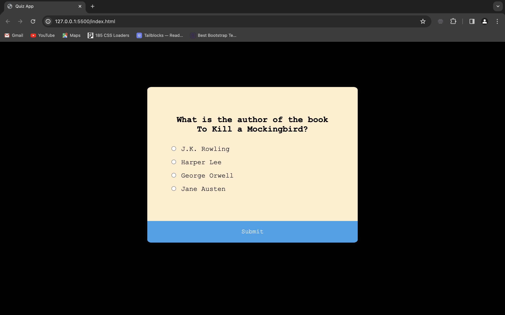

# Simple Quiz Website

This is a basic quiz website built using HTML, CSS, and JavaScript. The purpose of this project is to provide a simple template for creating quizzes.

## Files

- `index.html`: Contains the structure and content of the website.
- `style.css`: Defines the styles for the website.
- `script.js`: Implements the quiz logic using JavaScript.

## Sample Screenshot

